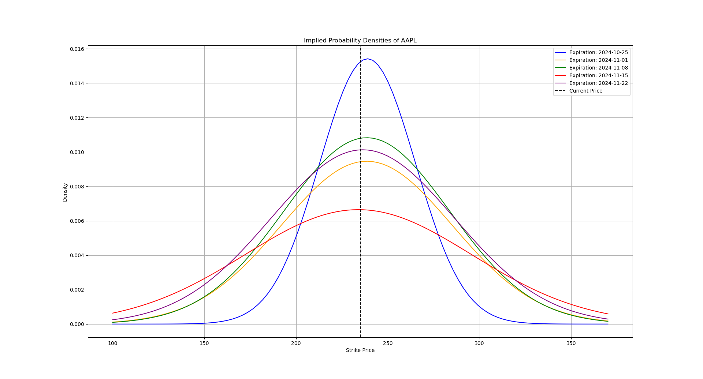

to estimate implied probability density of a given ticker

usage: change the ticker in `main.py` and run

todo:
- use put-call parity for better estimation
- make it work with indian tickers
- display important things like variance
- backtest

